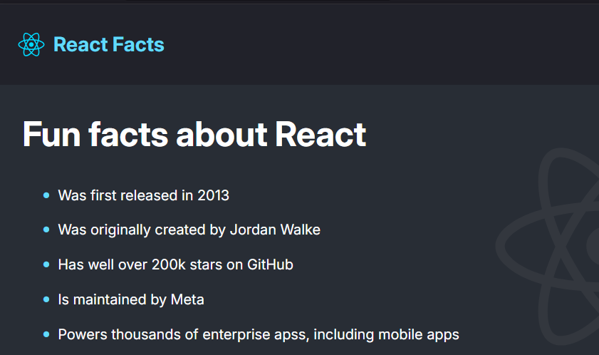

# react facts project
## About the project
it is a sample React project to make a static page give some facts about react 
the mian purpose to this project is to learn jsx and how to use it and who to integreate css with jsx 
## ✨ Features
- some facts about react
- usage of sementic html
## 🛠️ Built With
- React  
- vite
## 🖼️ Screenshots

## 👷‍♂️ Author
- name: Ali Haitham
- linkedin: [Ali Haitham](www.linkedin.com/in/ali-haitham-a23901232)